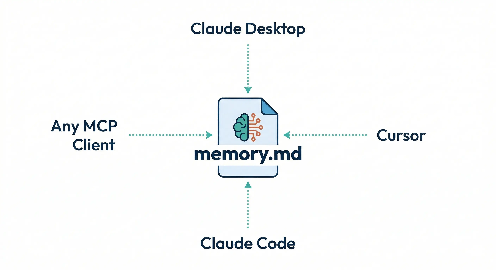

# memmd-mcp

[](https://pypi.org/project/memmd-mcp/)
[](https://pypi.org/project/memmd-mcp/)
[](https://pypi.org/project/memmd-mcp/)

<p align="center">
  
</p>

A shared memory layer for AI agents — one `memory.md` synced across Claude Desktop, Cursor, Claude Code, OpenAI Codex, and any MCP client. Auto-deduplication, contradiction resolution, and stale cleanup included.

> [!TIP]
> **Why memmd?**
> - **One memory, every client** — Claude Desktop, Cursor, Claude Code, OpenAI Codex share the same `memory.md`
> - Zero external dependencies beyond `mcp` — no embeddings, no API keys, fully offline
> - Deterministic, rule-based — no LLM calls for memory management
> - Human-readable `memory.md` — inspect and edit anytime

## Features

- **Deduplication** — fingerprint + Jaccard similarity merges near-identical entries
- **Contradiction resolution** — detects conflicting facts, keeps latest, archives old
- **Structured categories** — Work Context · Projects · Personal Preferences · Archive
- **Section-aware recall** — filter by category, keyword search with scoring
- **Stale cleanup** — auto-archives old, unused entries on `summarize()`
- **Korean support** — category aliases, fact patterns (`~는 ~`), stopwords

## Quick Start

### Install and run

```bash
uvx memmd-mcp
```

### Add to your MCP client

```json
{
  "mcpServers": {
    "memmd": {
      "command": "uvx",
      "args": ["memmd-mcp"],
      "env": {
        "MEMMD_MEMORY_PATH": "/absolute/path/to/memory.md"
      }
    }
  }
}
```

> [!NOTE]
> Config location by client:
> - **Claude Desktop** — `~/Library/Application Support/Claude/claude_desktop_config.json`
> - **Claude Code** — `.claude/settings.json` or user settings
> - **Cursor** — `~/.cursor/mcp.json`
> - **OpenAI Codex** — `~/.codex/config.toml`

## Tools

| Tool | Description |
|---|---|
| `remember(content, category?)` | Store with auto-dedupe and contradiction merge |
| `recall(query)` | Search with keyword scoring and category filters |
| `forget(id)` | Delete by ID |
| `summarize()` | Category overview + stale entry cleanup |

## How It Works

### `remember`
- Dedupes by SHA-1 fingerprint and Jaccard similarity (>0.82)
- Extracts facts from `key: value`, `key = value`, `key is value`, `key는 value`
- On conflict: latest value wins, old entry archived with history

### `recall`
- Keyword search with token-overlap scoring
- Filters: `category:Projects API token`, `section:"Work Context" deploy`
- Korean aliases accepted (`category:프로젝트`)

### `summarize`
- Per-category summary of recent entries
- Archives stale entries (default: >120 days, <3 accesses, no recent recall)

## `memory.md` Format

```md
# memory.md

<!-- memmd:version=1 -->

## Work Context
<!-- memmd-entry {...json...} -->
Memory content

## Projects
...

## Personal Preferences
...

## Archive
...
```

## Environment Variables

| Variable | Default | Description |
|---|---|---|
| `MEMMD_MEMORY_PATH` | `./memory.md` | Path to memory file |
| `MEMMD_STALE_DAYS` | `120` | Days before stale cleanup (min: 7) |

## Development

```bash
uv sync
uv run memmd-mcp          # run locally
uv build && uv publish    # publish to PyPI
```

## License

MIT

---

Language docs: [한국어](docs/README.ko.md)
